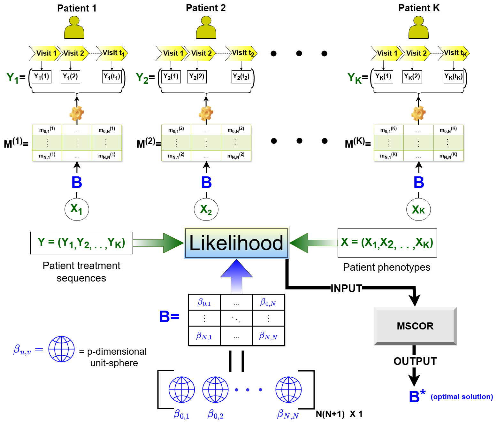
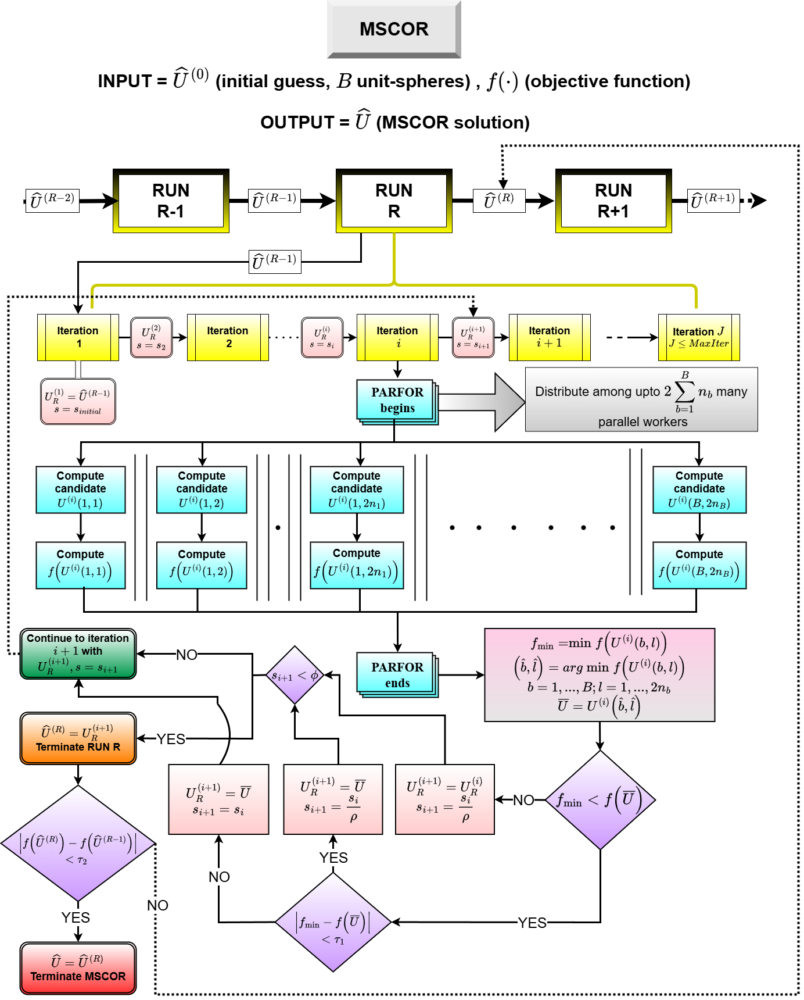
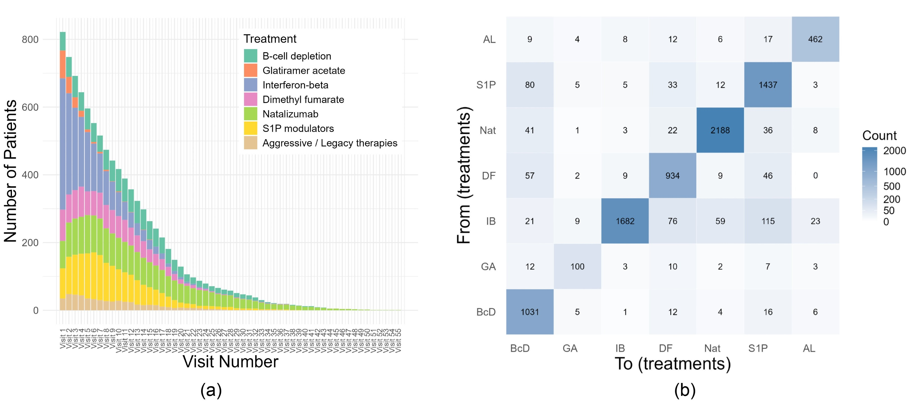
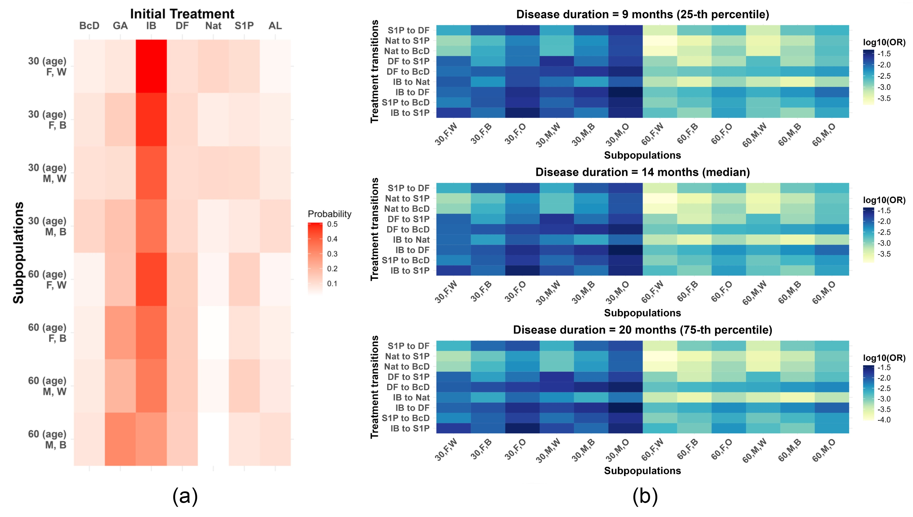

# SMART-MC and MSCOR: Reproducibility Repository

**Paper Title:**  SMART-MC: Characterizing the Dynamics of Multiple Sclerosis Therapy Transitions Using a Covariate-Based Markov Model 

This repository provides the necessary code and documentation for reproducing the results presented in the article above. It implements the **SMART-MC** model for estimating covariate-driven treatment transitions in Multiple Sclerosis, and introduces **MSCOR**, a novel global optimization routine designed for optimization over multiple spherically constrained parameter spaces.

---

## 📄 Paper Summary

The manuscript introduces:

- **SMART-MC**, a covariate-driven Markov model for estimating dynamic treatment transition probabilities in MS as a function of patient covariates.
- **MSCOR**, a spherically constrained optimization routine for globally optimizing black-box functions over parameter spaces constrained to collections of unit spheres.
- A benchmark study demonstrating the superiority of **MSCOR** over existing global optimization techniques such as Genetic Algorithms and Simulated Annealing.
- A comprehensive simulation study of **SMART-MC**, powered by **MSCOR**, evaluating estimation performance under various scenarios.
- An application of **SMART-MC** to real-world data to identify the influence of key clinical and demographic factors on both within- and across-treatment transition probabilities for MS-DMTs.

---

## 🧮 Figures and Tables in the Paper

To reproduce the tables and figures presented in the paper, please refer to `SMART_MC_Reproducibility_and_DEMO_instructions.pdf`. A brief overview is provided below.

| Output        | Description                                | Script Path                            |
|---------------|--------------------------------------------|----------------------------------------|
| **Figure 1**  | Sankey diagrams of treatment sequences     | `Real Data Analysis/Real Data/exploratory_analysis.R` |
| **Figures 5,6a** | Estimated transition probabilities (SMART-MC) | `Real Data Analysis/SMART_MC_Var_effect_plot.R` |
| **Figure 6b** | Odds ratios for across-treatment transitions | `Real Data Analysis/SMART_MC_ODDS_ratio_calculation.m` → `SMART_MC_Odds_ratio_plot.R` |
| **Table 1, S1**, **Figure S1**   | MSCOR benchmark results                    | `MSCOR Benchmark/MSCOR_Benchmark_comparison.m` → `MSCOR_post_evaluation.m` |
| **Tables S2–S5** | Simulation results                       | `Simulation Study/` (see details in `SMART_MC_Reproducibility_and_DEMO_instructions.pdf`)        |
| **Table S6**, **Figure S2** | SMART-MC estimated coefficients; simulated treatment trajectory | `Real Data Analysis/SMART_MC_Real_data.m` |

---

## 📦 Requirements

- **R version**: 4.3.1  
- **MATLAB**: R2022a or later  
- **Required R packages**:
  - `ggplot2`, `dplyr`, `tidyr`, `readr`, `patchwork`, `RColorBrewer`, `ggalluvial`, `reshape2`, `purrr`
 
### 🕒 Approximate Computation Time

For the case study involving 7 treatments, approximately 9,468 treatment records across 822 subjects, and \( p = 5 \) covariates, the SMART-MC estimation takes roughly **7–10 minutes** to complete. This benchmark was obtained on a **Windows 10 Enterprise** system with **32 GB RAM** and a **12th Gen Intel(R) Core(TM) i7-12700** processor (12 cores, 20 logical threads, 2.10 GHz base frequency).

---

## 📊 Key Visual Summaries

All major figures and visual outputs from the manuscript are available under the `Main Plots/` directory. Representative visuals include:

### SMART-MC Conceptual Framework

This schematic illustrates how individual patient trajectories, clinical covariates, and transition histories are integrated into the SMART-MC model via covariate-linked transition matrices.

### MSCOR Algorithm Flowchart

The MSCOR routine implements parallelized global search with run-specific adaptive step sizes, enabling robust optimization over non-convex surfaces constrained to spheres.

### Empirical Treatment Summaries

(a) Stacked bar plots showing visit-wise DMT frequencies. (b) Heatmap showing empirical transition counts between treatments.

### Initial Treatment and Odds Ratios

(a) Heatmap of estimated initial DMT probabilities across subgroups. (b) Odds ratios of switching versus remaining on the same treatment, stratified by disease duration.

### Covariate Effects on Transition Probabilities

Transition probabilities for common DMT changes as functions of age and disease duration, stratified by sex and race.

---

## 📁 Repository Structure

| Folder | Description |
|--------|-------------|
| `Real Data Analysis/` | Real data analysis scripts (Figures 1, 5, 6; Table S6) |
| `Simulation Study/` | Simulation experiments evaluating SMART-MC performance |
| `MSCOR Benchmark/` | MSCOR comparison with other optimizers (Table 1, Fig S1) |
| `Main_Plots/` | Final versions of all figures used in the manuscript |
| `SMART_MC_Reproducibility_and_DEMO_instructions.pdf` | Full reproduction instructions |

---

## 🔐 Data Access

The MS treatment data used in this study originate from the Mass General Brigham EHR system, including the CLIMB cohort. Due to privacy constraints, raw data cannot be released. However, example and synthetic datasets are included for demo and verification. See the manuscript for details on data structure and variables.

---

## 💬 Contact

For questions, please contact:  
**Priyam Das**  
[dasp4@vcu.edu](mailto:dasp4@vcu.edu)

